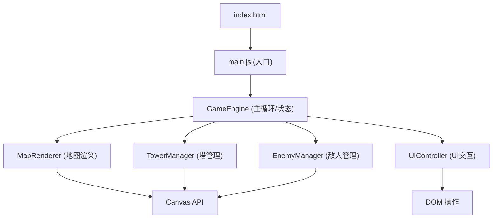

## 1. 架构设计



## 2. 技术描述

- **前端**：原生 JavaScript (ES Module) + HTML5 Canvas API
- **构建工具**：无（纯静态文件，直接浏览器运行）
- **后端**：无（纯前端实现）
- **数据存储**：无（游戏状态仅存于内存）

### 模块说明

| 模块 | 文件路径 | 职责 |
|------|---------|------|
| GameEngine | `src/GameEngine.js` | 游戏主循环（requestAnimationFrame）、状态管理（波次、金币、生命）、模块间协调 |
| MapRenderer | `src/MapRenderer.js` | 网格地图绘制、路径渲染、瓦片类型管理 |
| TowerManager | `src/TowerManager.js` | 塔的建造逻辑、攻击目标选择、子弹发射与管理 |
| EnemyManager | `src/EnemyManager.js` | 波次配置、敌人生成、沿路径移动、血量管理 |
| UIController | `src/UIController.js` | HUD 更新、建造菜单显示/隐藏、画布点击事件处理 |

## 3. 数据模型

### 3.1 瓦片类型
```javascript
const TILE_TYPES = {
  GRASS: 0,    // 可建造区域
  PATH: 1,     // 敌人路径
  START: 2,    // 入口
  END: 3       // 出口
}
```

### 3.2 塔类型配置
```javascript
const TOWER_TYPES = {
  ARROW: {
    name: '箭塔',
    cost: 50,
    damage: 10,
    range: 3,           // 格子数
    fireRate: 0.5,      // 秒
    color: '#3498db',
    splashRadius: 0
  },
  CANNON: {
    name: '炮塔',
    cost: 100,
    damage: 35,
    range: 4,
    fireRate: 1.5,
    color: '#e67e22',
    splashRadius: 1.2   // 格子数
  }
}
```

### 3.3 波次配置
```javascript
const WAVES = [
  { count: 8,  hp: 50,  speed: 1.0, reward: 10, interval: 1.0 },
  { count: 12, hp: 100, speed: 1.1, reward: 15, interval: 0.8 },
  { count: 18, hp: 180, speed: 1.2, reward: 20, interval: 0.6 }
]
```

## 4. 核心算法

### 4.1 路径寻路
- 预设路径坐标数组（格子坐标），敌人通过线性插值沿路径移动
- 路径示例：从左侧 (0,7) 进入，经过多个拐点，最终到达右侧 (19,7)

### 4.2 塔攻击目标选择
- 遍历射程范围内所有敌人
- 选择路径进度最靠前（最接近终点）的敌人作为目标

### 4.3 子弹碰撞检测
- 子弹位置与敌人位置欧氏距离判定
- 炮塔子弹命中时计算溅射范围内所有敌人

## 5. 游戏状态枚举
```javascript
const GAME_STATE = {
  WAITING: 'waiting',     // 波次间隔倒计时
  PLAYING: 'playing',     // 战斗中
  WIN: 'win',             // 胜利
  LOSE: 'lose'            // 失败
}
```
