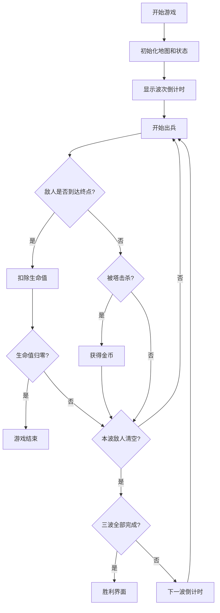

## 1. 产品概述

"像素守卫"是一款基于 HTML5 Canvas 的 2D 塔防游戏，采用像素艺术风格，玩家需要在预设路径两侧建造防御塔来阻止敌人到达终点。

- 主要用途：提供休闲策略游戏体验，锻炼玩家的资源规划和战术布置能力
- 目标用户：喜欢塔防类游戏的休闲玩家
- 产品价值：纯前端实现，无需安装，可直接在浏览器中运行的轻量化游戏

## 2. 核心功能

### 2.1 功能模块

1. **游戏主界面**：20×15 网格地图、顶部 HUD 信息栏、建造菜单
2. **地图系统**：预设路径瓦片标记、可建造区域、入口/出口标识
3. **防御塔系统**：箭塔（攻速快、伤害低、射程短）、炮塔（攻速慢、伤害高、范围溅射）
4. **敌人系统**：三波次出兵，血量和数量递增
5. **经济系统**：击杀敌人获得金币、建造塔消耗金币
6. **生命系统**：20 点生命值，敌人到达终点扣血

### 2.2 页面详情

| 页面名称 | 模块名称 | 功能描述 |
|-----------|-------------|---------------------|
| 游戏主界面 | HUD 信息栏 | 显示当前波次、金币数量、生命值、波次倒计时 |
| 游戏主界面 | 地图渲染 | 20×15 网格、路径瓦片、防御塔、敌人、子弹渲染 |
| 游戏主界面 | 建造菜单 | 点击空地弹出，选择塔类型进行建造 |
| 游戏主界面 | 游戏结束 | 生命值归零时显示游戏结束界面，可重新开始 |

## 3. 核心流程

玩家点击开始游戏 → 第一波倒计时 → 敌人沿路径从左至右移动 → 点击空地建造防御塔 → 塔自动攻击敌人 → 击杀敌人获得金币 → 波次结束进入下一波倒计时 → 三波结束或生命值归零 → 游戏结束

## 4. 用户界面设计

### 4.1 设计风格

- **主色调**：深绿色背景（#1a3a2a）代表草地、棕色路径（#8b6914）、像素风格
- **辅助色**：金色（#ffd700）表示金币、红色（#e74c3c）表示生命/敌人、蓝色（#3498db）表示箭塔、橙色（#e67e22）表示炮塔
- **字体**：像素风格字体（Press Start 2P 或 monospace）
- **布局**：顶部 HUD 栏 + 居中画布 + 弹出式建造菜单
- **视觉元素**：像素化的塔、敌人、子弹，清晰的网格线

### 4.2 页面设计概述

| 页面名称 | 模块名称 | UI 元素 |
|-----------|-------------|-------------|
| 游戏主界面 | HUD 信息栏 | 波次徽章、金币图标+数值、心形图标+生命条、倒计时数字 |
| 游戏主界面 | 地图画布 | 绿色草地瓦片、棕色路径瓦片、塔建筑、移动敌人、飞行子弹、爆炸效果 |
| 游戏主界面 | 建造菜单 | 半透明背景面板、塔图标、名称、属性（伤害/攻速/射程）、建造按钮、取消按钮 |
| 游戏主界面 | 结束界面 | 半透明遮罩、大标题（胜利/失败）、统计信息、重新开始按钮 |

### 4.3 响应式

- 桌面端优先设计，固定画布尺寸（800×600px，每格 40px）
- 支持窗口缩放时画布居中显示
